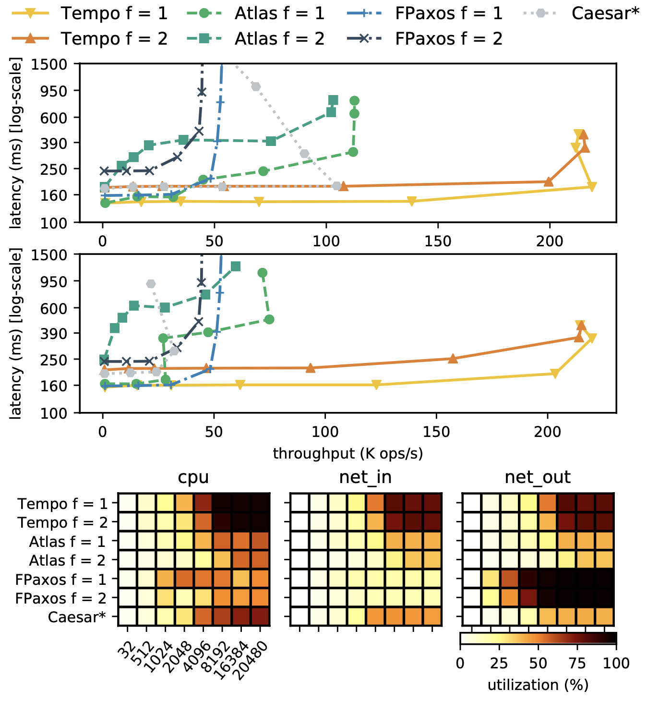

### `fantoch`: framework for evaluating (planet-scale) consensus protocols

#### Protocols implemented
- [Tempo (EuroSys'21)](https://vitorenes.org/publication/enes-tempo/): [source](https://github.com/vitorenesduarte/fantoch/tree/main/fantoch_ps/src/protocol/tempo.rs)
- [Atlas (EuroSys'20)](https://vitorenes.org/publication/enes-atlas/): [source](https://github.com/vitorenesduarte/fantoch/tree/main/fantoch_ps/src/protocol/atlas.rs)
- [EPaxos (SOSP'13)](https://www.cs.cmu.edu/~dga/papers/epaxos-sosp2013.pdf): [source](https://github.com/vitorenesduarte/fantoch/tree/main/fantoch_ps/src/protocol/epaxos.rs)
- [FPaxos (OPODIS'16)](https://fpaxos.github.io/): [source](https://github.com/vitorenesduarte/fantoch/tree/main/fantoch_ps/src/protocol/fpaxos.rs)
- [Caesar (DSN'17)](https://arxiv.org/abs/1704.03319): [source](https://github.com/vitorenesduarte/fantoch/tree/main/fantoch_ps/src/protocol/caesar.rs)
- [Janus (OSDI'16)](https://www.usenix.org/system/files/conference/osdi16/osdi16-mu.pdf): [source](https://github.com/vitorenesduarte/fantoch/tree/main/fantoch_ps/src/protocol/atlas.rs)

#### What does it do?

- all protocols implement the [`Protocol`](https://github.com/vitorenesduarte/fantoch/blob/master/fantoch/src/protocol/mod.rs) trait
- this specification can then be used for
  - __simulating__ the expected latency in a given geo-distributed scenario (infinite CPU and network bandwidth are assumed)
  - __running__ the protocols in a real setting (e.g. baremetal, AWS, Azure)
  - __model checking__ _(coming soon)_
- this is achieved by providing a __"simulator"__ and a __"runner"__ that are protocol-agnostic and are only aware of the `Protocol` (and [`Executor`](https://github.com/vitorenesduarte/fantoch/blob/master/fantoch/src/executor/mod.rs)) trait

`fantoch` is also capable of generating plots like the following one:

For more information, consult our paper [Efficient Replication via Timestamp Stability (EuroSys'21)](https://vitorenes.org/publication/enes-tempo/).

## License

Licensed under either of

 * Apache License, Version 2.0, ([LICENSE-APACHE](LICENSE-APACHE) or http://www.apache.org/licenses/LICENSE-2.0)
 * MIT license ([LICENSE-MIT](LICENSE-MIT) or http://opensource.org/licenses/MIT)

at your option.

### Contribution

Unless you explicitly state otherwise, any contribution intentionally submitted for inclusion in the work by you, as defined in the Apache-2.0 license, shall be dual licensed as above, without any additional terms or conditions.
